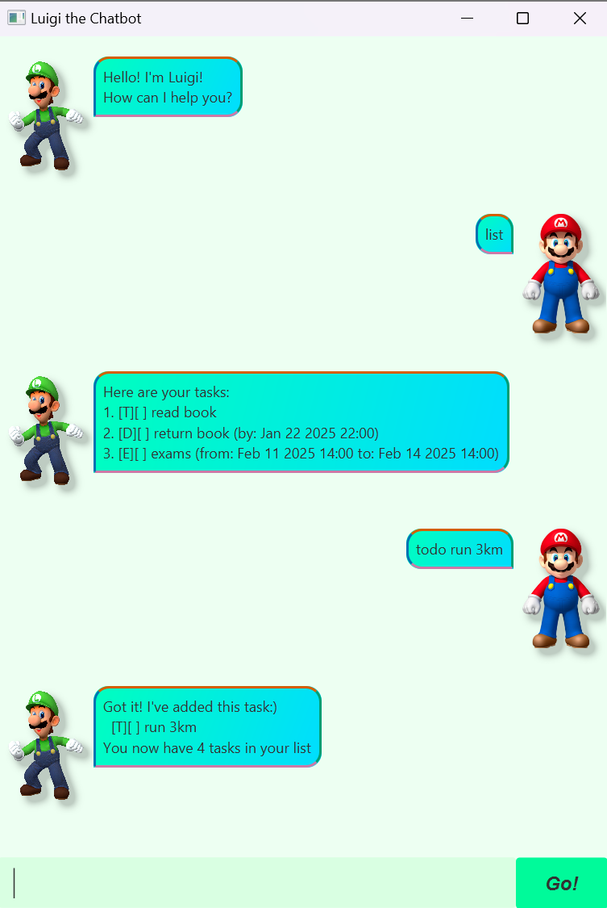

# Luigi User Guide



## Introducing Luigi!

A desktop app for managing tasks, optimized for use via a **Command Line Interface** (CLI) while still having a **Graphical User Interface** (GUI).

With Luigi, you can:
- [x] [Add todo, deadline and event tasks](#adding-tasks)
- [x] [Delete tasks](#delete-tasks)
- [x] [Mark and unmark tasks as done](markunmark-task-as-done)
- [x] [Find tasks with the same date or keyword](find-tasks)
- [x] [Get reminders on upcoming tasks](get-reminders)

## Adding tasks

To add a **todo task**, type: 
```
todo {nameoftask}  |  eg: todo read book
```
To add a **deadline task**, type:
```
deadline {nameoftask} /by YYYY-MM-DD HHmm  |  eg: deadline return book /by 2025-02-20 1400
```
To add an **event task**, type:
```
event {nameoftask} /from YYYY-MM-DD HHmm /to YYYY-MM-DD HHmm  |  eg: event book club meeting /from 2025-02-20 1500 /to 2025-02-20 1700
```

## Delete tasks

To **delete** a task, type:
```
delete {indexoftask}  |  eg: delete 1
```

## Mark/Unmark task as done

To **mark/unmark** a task as done/undone, type:
```
mark {indexoftask} OR unmark {indexoftask}  |  eg: mark 1 OR unmark 1
```

## Find tasks

To find tasks that occur on the **same date**:
```
date YYYY-MM-DD HHmm  |  eg: date 2025-02-20
```
To find tasks with the **same keyword**:
```
find {keyword}  |  eg: find book
```

## Get reminders

To get reminded on which tasks are due within **x hours**, type:
```
remind {x}  |  eg: remind 24
```

## To use Luigi
1. download the jar file from [here](https://github.com/laishuya/ip/releases/tag/v0.1/)
2. type `java -jar luigi.jar` on your terminal to run Luigi 🤯
